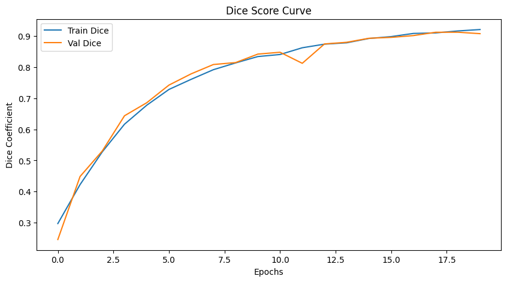
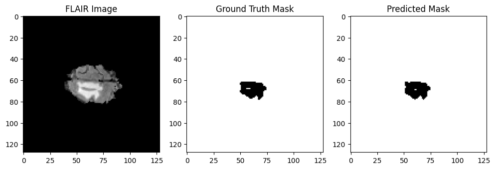
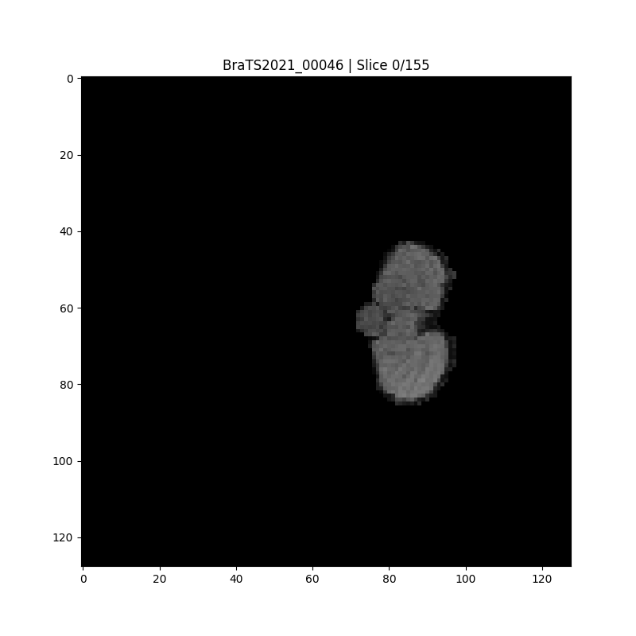
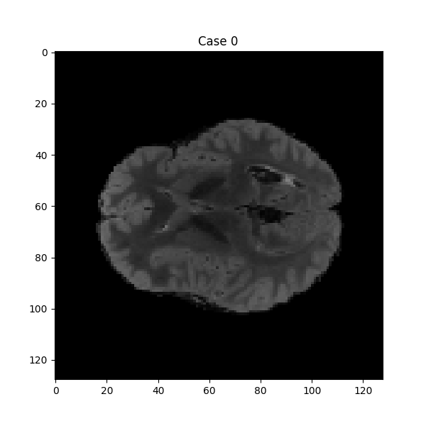
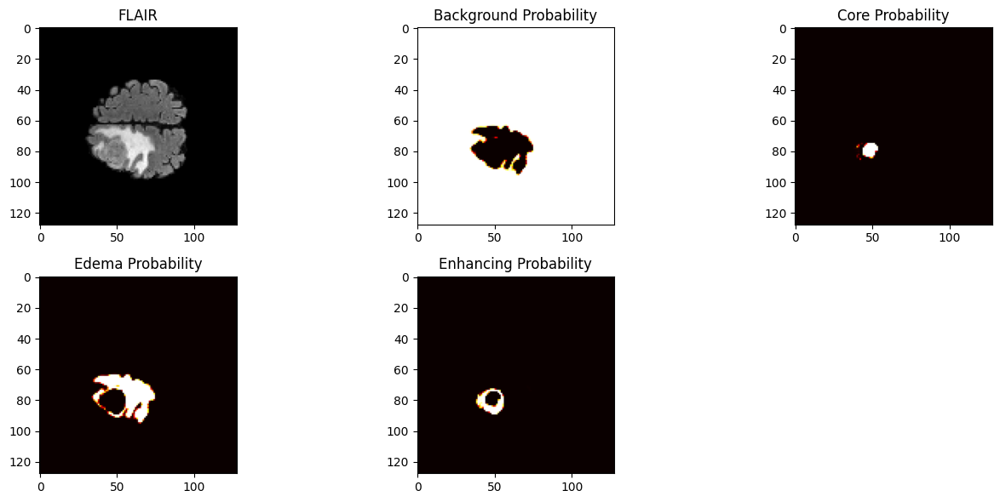

# Brain Tumor Segmentation from MRI Scans Using Deep Learning

## Project Overview
This project focuses on building a deep learning model to **automatically segment brain tumors from MRI scans**. Unlike simple tumor detection, this system performs **pixel-wise segmentation**, identifying exact tumor boundaries and sub-regions.

This project was completed as a **1-month Winter Project** under the mentorship of **BioX Club, IIT Bombay**.  
Over the project duration, I:

- Worked with real medical imaging data (NIfTI files)
- Understood MRI physics & tumor biology
- Built a complete Deep Learning pipeline
- Implemented **U-Net** for biomedical segmentation
- Trained using **BraTS 2021 Dataset**
- Evaluated using clinical metrics
- Designed meaningful visualizations

---

## Dataset
Dataset: **BraTS 2021 - Task 1 (Brain Tumor Segmentation)**  
https://www.kaggle.com/datasets/dschettler8845/brats-2021-task1

Each patient includes **4 MRI modalities**:
| Modality | Description |
|--------|-------------|
| **FLAIR** | Highlights lesions & edema |
| **T1** | Structural anatomical detail |
| **T1CE** | Enhancing tumor appears bright |
| **T2** | Fluid & edema visualization |

Labels in segmentation mask:
- `0` → Background  
- `1` → Tumor Core  
- `2` → Edema  
- `4` → Enhancing Tumor  
(Label `4` mapped to `3` internally for multiclass training)

---

## Task Type
This is a **semantic segmentation** task:
> “Which pixels belong to tumor, and which type of tumor?”

Output is a mask image with tumor regions segmented.

---

## Model Architecture — U-Net
The model is based on the **U-Net architecture** proposed in  
📄 *Ronneberger et al., “U-Net: Convolutional Networks for Biomedical Image Segmentation”, MICCAI 2015*

Key properties:
- Encoder → extracts features
- Bottleneck → high-level tumor understanding
- Decoder → reconstructs segmentation mask
- **Skip connections** → preserve spatial details

Implementation inspired by NVIDIA Medical U-Net TensorFlow reference.

---

## Training Details
- Framework: **TensorFlow / Keras**
- Image Size: `128×128`
- Model Type: **2D Multi-Class U-Net**
- Loss: Dice Loss
- Metrics:
  - Dice Score
  - IoU
  - Categorical Accuracy
- Optimizer: Adam
- Hardware: Trained on **Colab GPU** (NVIDIA T4)

---

## Evaluation & Performance

The model was trained for **20 epochs** with Early Stopping.
Training converged smoothly with excellent generalization.

### Final Metrics
| Metric | Train | Validation |
|--------|--------|-----------|
| Dice Coefficient | **0.92+** | **0.91+** |
| IoU | **0.86+** | **0.84+** |
| Categorical Accuracy | ~0.998 | ~0.997 |

> Best Validation Dice ≈ **0.912**  
> Best Validation IoU ≈ **0.847**

---

## Dice Score Learning Curve
Shows stable learning & strong validation alignment.

---

## Visual Results

### Single Slice Segmentation Example
Left: MRI Slice  
Middle: Ground Truth Mask  
Right: Predicted Mask

---

### Color Meaning in Masks
Tumor regions are visualized using distinct meaningful colors:

| Color | Region | Label |
|------|--------|--------|
| 🔵 Blue | Tumor Core | 1 |
| 🟢 Green | Edema (swelling around tumor) | 2 |
| 🔴 Red | Enhancing Tumor (actively growing tumor) | 4 |

Background is black.

These are clinically important distinctions:
- **Red (Enhancing Tumor)** = most critical for treatment
- **Green (Edema)** = shows tumor spread / pressure impact
- **Blue (Core)** = necrotic / solid tumor region

---

## Visualizations

### Single Patient Brain Sweep
Scrolls through all MRI slices of a patient with predicted segmentation overlay.

---

### Multiple Patient Comparison
Shows multiple patient predictions side-by-side.

---

### Modality Comparison
Visualizing how each MRI type contributes to tumor visibility.

---

### Per-Patient Prediction Overview
Model predictions visualized across multiple cases.

---

### Colored Segmentation Overlay Example
Overlay of segmentation mask over brain slice.

---

## Interpretation
- High Dice & IoU scores → strong overlap with expert annotations
- Tiny gap between training & validation → excellent generalization
- Visually meaningful masks confirm clinical reliability
- Successfully identifies tumor structure + spread

---

## Future Improvements
If extended further, I would like to:
- Train on **full dataset instead of 50 patients**
- Move to **3D U-Net**
- Add attention mechanisms
- Uncertainty estimation
- Compare with nnU-Net

---

## Acknowledgements
Thanks to:
- **BioX Club, IIT Bombay**
- **BraTS Challenge Team**
- **Kaggle Dataset Providers**
- Mentors & peers who guided this learning journey

---

## Conclusion
This project gave me hands-on experience with medical AI, MRI processing, deep learning model design, evaluation, and scientific visualization.  
A satisfying project both technically and emotionally — building something meaningful for healthcare.

---
